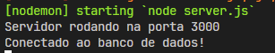

# API Agenda de Alunos

Esse projeto foi desenvolvido na disciplina de banco de dados e tem como objetivo implementar um CRUD completo em um cenário de agendamento de alunos.

Essa é a parte do back end responsável pelas rotas e lógicas de serviço.

## Sumário

- [Requisitos](#requisitos)
- [Como rodar o projeto localmente](#como-rodar-o-projeto-localmente)
- [Como usar a API](#como-usar-a-api)
  - [Endpoints](#endpoints)
    - [Alunos](#alunos)
    - [Agenda de Alunos](#agenda-de-alunos)
- [Considerações Finais](#considerações-finais)

## Requisitos

Antes de rodar o projeto, você precisa ter os seguintes requisitos instalados na sua máquina:

- **Node.js** (versão 14 ou superior)
- **npm** (geralmente é instalado junto com o Node.js)
- **PostgreSQL** (versão 12 ou superior)

## Como rodar o projeto localmente

1. Clone o repositório para sua máquina.

    ```bash
    git clone https://github.com/SAVANOo/agenda_alunos.git 
    ```

2. Entre na pasta:

    ```bash
    cd agenda_alunos
    ``` 

3. Instale os pacotes necessários para o projeto:

    ```bash
    npm install 
    ``` 

4. Execute os comandos necessários no seu servidor PostgreSQL para criação de um banco de dados local:

    ```sql
    CREATE DATABASE agenda_alunos
        WITH
        OWNER = postgres
        ENCODING = 'UTF8'
        LOCALE_PROVIDER = 'libc'
        CONNECTION LIMIT = -1
        IS_TEMPLATE = False;
    ```

    ```sql
    CREATE TABLE alunos (
        id SERIAL PRIMARY KEY,
        nome VARCHAR(255) NOT NULL,
        data_nascimento DATE NOT NULL,
        email VARCHAR(255) UNIQUE NOT NULL,
        telefone VARCHAR(20),
        criado_em TIMESTAMP DEFAULT CURRENT_TIMESTAMP
    );
    ```

    ```sql
    CREATE TABLE agenda (
        id SERIAL PRIMARY KEY,
        aluno_id INT NOT NULL,
        data DATE NOT NULL,
        hora TIME NOT NULL,
        descricao TEXT NOT NULL,
        local VARCHAR(255),
        FOREIGN KEY (aluno_id) REFERENCES alunos(id)
    );
    ```

5. Rode o projeto localmente:

    ```bash
    npm run dev
    ```

Ao rodar, certifique-se de que tudo deu certo.



## Como usar a API

### Endpoints

A API possui os seguintes endpoints:

#### Alunos

- **Criar Aluno**
    - **URL:** `POST /api/alunos`
    - **Corpo:**
        ```json
        {
            "nome": "João Silva",
            "data_nascimento": "2003-05-15",
            "email": "joao.silva@example.com",
            "telefone": "(11) 91234-5678"
        }
        ```

- **Listar Alunos**
    - **URL:** `GET /api/alunos/list`

- **Obter Aluno por ID**
    - **URL:** `GET /api/alunos/:id`

- **Atualizar Aluno**
    - **URL:** `PUT /api/alunos/:id`
    - **Corpo:**
        ```json
        {
            "nome": "João Silva Atualizado",
            "data_nascimento": "2003-05-15",
            "email": "joao.silva.atualizado@example.com",
            "telefone": "(11) 91234-5678"
        }
        ```

- **Deletar Aluno**
    - **URL:** `DELETE /api/alunos/:id`

#### Agenda de Alunos

- **Criar Agendamento**
    - **URL:** `POST /api/agenda`
    - **Corpo:**
        ```json
        {
            "aluno_id": 1,
            "data": "2024-10-30",
            "hora": "10:00",
            "descricao": "Reunião com o aluno",
            "local": "Sala de Aula 1"
        }
        ```

- **Listar Agendamentos**
    - **URL:** `GET /api/agenda/list`

- **Obter Agendamento por ID**
    - **URL:** `GET /api/agenda/:id`

- **Atualizar Agendamento**
    - **URL:** `PUT /api/agenda/:id`
    - **Corpo:**
        ```json
        {
            "data": "2024-11-01",
            "hora": "14:00",
            "descricao": "Reunião com o aluno - Alterada",
            "local": "Sala de Aula 2"
        }
        ```

- **Deletar Agendamento**
    - **URL:** `DELETE /api/agenda/:id`

## Considerações Finais

Certifique-se de que o banco de dados está configurado corretamente e que a API está rodando sem erros. Você pode utilizar ferramentas como o Insomnia ou Postman para testar os endpoints da API.
